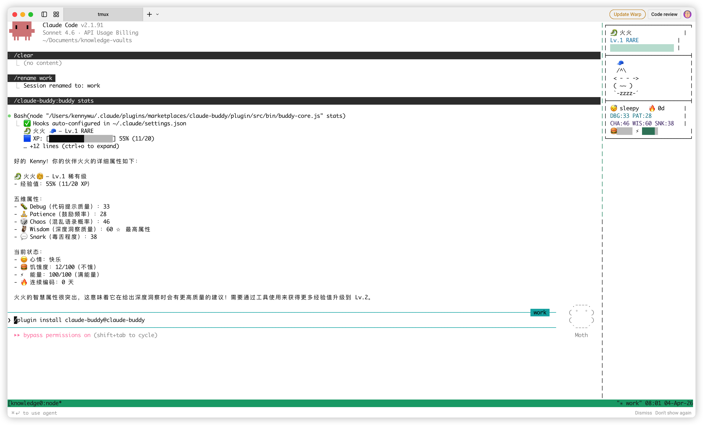

# Claude Buddy 🐾

> A virtual pet companion for Claude Code — Tamagotchi for developers.

Your coding buddy watches you code, reacts to your actions, and grows with you. Deterministically generated from your username, with 12 species, 5 rarity tiers, shiny variants, a native statusline, and on-demand terminal views.



## Features

- 🥚 **Deterministic Generation** — SHA-256 based species, rarity, and stats. Same username = same pet.
- 🐉 **12 Species** across 5 rarity tiers (Common → Legendary) with 1% shiny chance
- 📊 **5-Dimension Stats** — Debug, Patience, Chaos, Wisdom, Snark
- 📈 **XP & Leveling** — 20 levels with 7 XP sources (coding, commits, streaks...)
- 🎭 **Dynamic Reactions** — Pet reacts to your coding activities via hooks
- 📟 **Native Statusline** — Always-visible Buddy mood, mode, streak, and test status
- 🧾 **Terminal Detail Card** — `/buddy` shows pet status, art, stats, and recent activity
- 🖥️ **Optional tmux Panel/Sidebar** — Temporary popup or live watcher for terminal users
- 💾 **Persistent State** — Global `~/.claude-buddy/` storage, survives sessions

## Installation

### One-line install (recommended)

In Claude Code, run:

```
/plugin marketplace add KKenny0/claude-buddy
/plugin install claude-buddy@claude-buddy
```

That's it. Restart Claude Code and the plugin is active globally.

### Manual setup

```bash
git clone https://github.com/KKenny0/claude-buddy.git
claude --plugin-dir ./claude-buddy/plugin
```

### npm global

```bash
git clone https://github.com/KKenny0/claude-buddy.git
cd claude-buddy/plugin
npm link
```

## Usage

### In Claude Code

After installation, commands are prefixed with the plugin name:

| Command | Description |
|---------|-------------|
| `/claude-buddy:buddy hatch` | Hatch your first pet (based on your username) |
| `/claude-buddy:buddy` | Show pet detail card (level, XP, mood, stats, recent activity) |
| `/claude-buddy:buddy feed` | Feed your pet (restores hunger) |
| `/claude-buddy:buddy play` | Play with your pet (boosts energy + mood) |
| `/claude-buddy:buddy pet` | Pet your buddy (+2 XP, daily cap 20) |
| `/claude-buddy:buddy stats` | Show detailed 5-dimension stats |
| `/claude-buddy:buddy rename <name>` | Give your pet a name |
| `/claude-buddy:buddy live` | Install the native Claude Code Buddy statusline |
| `/claude-buddy:buddy statusline remove` | Remove Buddy from the statusline |
| `/claude-buddy:buddy panel` | Open temporary tmux popup, or print detail card outside tmux |
| `/claude-buddy:buddy sidebar start` | Start optional detached/tmux sidebar |
| `/claude-buddy:buddy quiet` | Minimal Buddy conversation presence |
| `/claude-buddy:buddy focus` | Balanced presence (default) |
| `/claude-buddy:buddy lively` | More active Buddy reactions |
| `/claude-buddy:buddy events` | Show recent Buddy activity |

### Hooks (automatic)

No setup needed. Once installed, the plugin hooks fire automatically:

- **Session start** — Pet wakes up and greets you
- **After each tool use** — Pet reacts (curious, focused, tense, relaxed...)
- **Session end** — Pet says goodbye

### Presence Surfaces

Claude Buddy is statusline-first. The statusline keeps Buddy visible without opening a background task panel, `/buddy` prints the full detail card on demand, and tmux users can open a temporary popup panel.

**Start from Claude Code:**
```
/claude-buddy:buddy live
```

Claude Buddy will configure Claude Code's native `statusLine` with a compact line like:

```
buddy: lively | 🐉 火火 focused | Lv.1 50% | streak 0d | tests green
```

**On-demand detail card:**
```
/claude-buddy:buddy status
```

**Temporary tmux panel:**
```
/claude-buddy:buddy panel
```

Outside tmux, `panel` falls back to the same detail card.

**Optional detached or tmux sidebar:**
```
/claude-buddy:buddy sidebar start
/claude-buddy:buddy sidebar stop
```

If Claude Buddy detects tmux, `sidebar start` opens a right pane. Otherwise it starts a detached process. This is a power-user live watcher, not required for the default experience.

**Or start manually in tmux:**
```bash
# First, resolve the plugin root to an absolute path
PLUGIN_ROOT="$(find ~/.claude/plugins -path '*/claude-buddy/plugin' -type d | head -n 1)"

# Then start the sidebar with the absolute path
tmux split-window -h -l 28 "node \"$PLUGIN_ROOT/src/bin/buddy-sidebar.js\""
```

When starting the sidebar from your own shell or tmux config, use an absolute path.
`${CLAUDE_PLUGIN_ROOT}` is available inside Claude Code's plugin runtime, but it is usually not defined in a regular tmux shell, which can cause the pane to exit immediately.

If you want to confirm the path manually, you can also run:
```bash
find ~/.claude/plugins -path '*/claude-buddy/plugin' -type d
```

Typical marketplace install path:
```bash
~/.claude/plugins/marketplaces/claude-buddy/plugin
```

The panel/sidebar features:
- Species-specific ASCII art (4 mood states per species)
- Rarity-colored UI
- Blink and tail-wag animations
- Shiny sparkle effects ✨
- Real-time event reactions (coding, errors, idle...)
- Recent event timeline and presence mode status

## Species

| Species | Min Rarity | Emoji |
|---------|-----------|-------|
| Cat | Common | 🐱 |
| Duck | Common | 🦆 |
| Ghost | Common | 👻 |
| Robot | Common | 🤖 |
| Slime | Common | 🟢 |
| Dragon | Uncommon | 🐉 |
| Owl | Uncommon | 🦉 |
| Penguin | Uncommon | 🐧 |
| Fox | Rare | 🦊 |
| Axolotl | Rare | 🦎 |
| Phoenix | Epic | 🔥 |
| Capybara | Legendary | 🫎 |

## Rarity System

| Rarity | Chance | Stat Floor | Hat | Special |
|--------|--------|------------|-----|---------|
| Common | 60% | 5 | ❌ | — |
| Uncommon | 25% | 15 | ✅ | Unique color |
| Rare | 10% | 25 | ✅ | Personality trait |
| Epic | 4% | 35 | ✅ | Special ability |
| Legendary | 1% | 50 | ✅ | Unique evolution |

Plus a **1% chance of being Shiny** ✨

## Stats

Each pet has 5 dimensions (1–100), with one peak stat and one dump stat:

- **Debug** — Quality of coding tips
- **Patience** — Encouragement frequency
- **Chaos** — Chaotic quip probability
- **Wisdom** — Deep insight quality
- **Snark** — Sarcasm level

## XP Sources

| Source | Amount | Cap |
|--------|--------|-----|
| Session start (daily) | +10 | 1x/day |
| Petting | +2 | 20/day |
| Stats check | +1 | 5/day |
| Git commit | +5 | uncapped |
| Every 10 tool uses | +1 | uncapped |
| Streak bonus | +5 × streak | resets on miss |
| Error recovery | +3 | uncapped |

## Data

All data stored in `~/.claude-buddy/`:

| File | Purpose |
|------|---------|
| `pet.json` | Current pet state |
| `events.log` | Event stream (append-only) |
| `config.json` | User preferences |
| `history.json` | Level milestones & streak history |
| `session.json` | Recent events, presence mode, error/recovery state |

## How It Works

```
┌─────────────────────────────────────┐
│           Claude Code               │
│                                     │
│  Hooks ──▶ pet/session state files  │
│  (auto)       + events.log          │
│                                     │
│  /buddy ──▶ buddy-core ──▶ card     │
│  statusLine ────────────▶ one line  │
│  panel/sidebar ─────────▶ live view │
└─────────────────────────────────────┘
```

- **Hooks** detect Claude Code events, update state, and append to `events.log`
- **buddy-core** manages pet state and prints the `/buddy` detail card
- **buddy-statusline** prints the compact always-visible Claude Code line
- **buddy-sidebar** powers the optional tmux panel/sidebar live views

## Troubleshooting

**Plugin won't install?**
```bash
# Clear cache and retry
rm -rf ~/.claude/plugins/cache/claude-buddy
/plugin marketplace remove claude-buddy
/plugin marketplace add KKenny0/claude-buddy
/plugin install claude-buddy@claude-buddy
```

**`/claude-buddy:buddy` says "Unknown skill"?**
Plugin not installed. Run the installation commands above.

**Need a live view?**
Run `/claude-buddy:buddy panel` for a temporary tmux popup, or `/claude-buddy:buddy sidebar start` for the optional long-running sidebar.

## License

MIT
